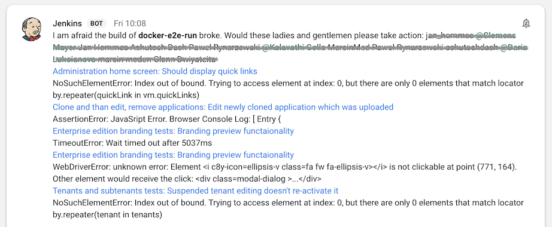

# Overview

This is a Jenkins plugin to connect Jenkins to Google Hangouts Chat rooms. It can be used in traditional Jenkins build jobs as well as in Jenkins Pipelines to report a summary of a broken build into a chat. The summary is constructed from JUnit, Cucumber and Maven reports and links to the relevant test failures in Jenkins. If the "culprits" are members of the chat room, they will be mentioned.

# Setup (Google side)

To set it up, you need to first create a service account in Google that can be used by the plugin. The process is described here: https://developers.google.com/hangouts/chat/how-tos/service-accounts#creating_and_using_a_service_account. As a result, you will get a file that you need to upload to Jenkins (see below).

Then create a bot as described in https://developers.google.com/hangouts/chat/how-tos/bots-publish. Give it a name (Jenkins) and an image. You should now be able to add the bot to rooms in Hangouts Chat. Go to a room, click "Add people and bots" in a room, search for your bot and click "Send". 

# Setup (Jenkins side)

You need a fairly recent version of Jenkins (2.121.1 or more recent) and the [Plain Credentials plugin](https://plugins.jenkins.io/plain-credentials). 

* Go to "Credentials", "System", "Global credentials (unrestricted)" and click "Add credentials".
* In the "Kind" drop-down, select "Secret file".
* Leave "Scope" as "Global". 
* Click "Choose File" and select the credentials file that you downloaded during the setup of the service account above.
* Enter "Hangouts" as ID. Use exactly this ID, otherwise the chat plugin will not find the credentials. 

If you do not have the chat plugin binary already, you can build it from source by using "mvn package" and at least Java 8. As output of the build, there is a file "target/hangouts-chat.hpi" that you can upload to Jenkins ("Manage Jenkins", "Manage plugins", "Advanced", "Upload plugin"). Restart Jenkins after upload. 

# Usage

To send broken build notices to a chat room, you need to determine the ID of that chat room. Open https://chat.google.com" in your web browser and navigate to the chat room. Your browser URL will be https://chat.google.com/room/<ID>. The ID is a text string such as "AAAAowtzMMY".

Now go to the Jenkins job that should send notices to the room. If it is a "classical" job, you should be able to add a "Post-build action" with the name "Send to chat". Paste the room ID there. Only failed builds will cause a message to be sent.

If it is a Jenkins Pipeline job, you can use a pipeline step with the name "chat" in the "post" section. For example:

	 post {
        always {
            cucumber 'e2e/reports/json/*.json'
        }
        failure {
            chat 'AAAAnoHMphE'
        }
    }
 
 